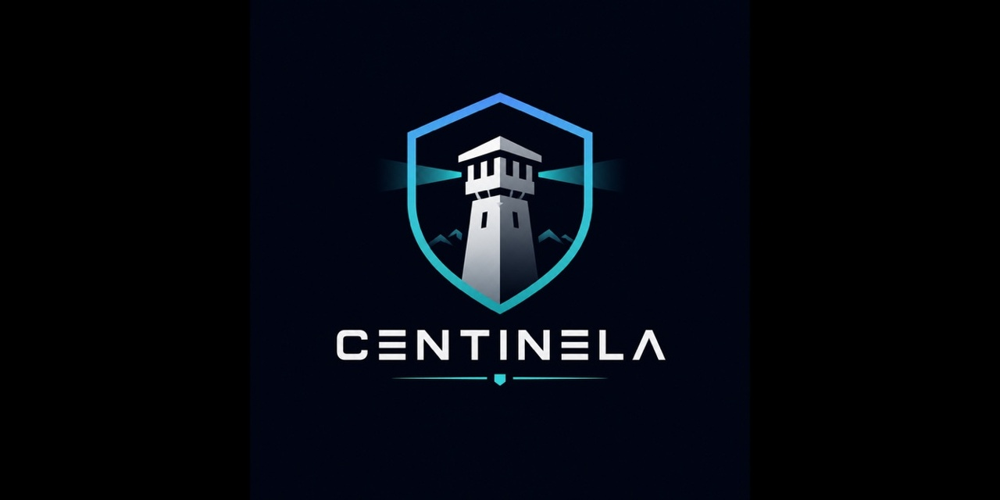
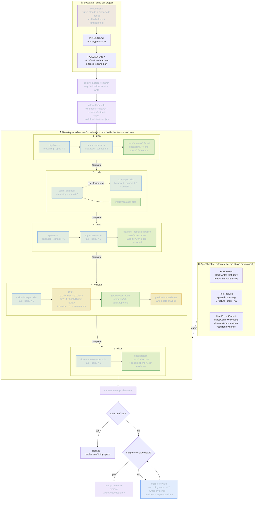

<p align="center">
  
</p>

# Centinela

> **Plan → code → tests → validate → docs — enforced.**

<p align="left">
  <a href="https://github.com/samuelnp/centinela/actions/workflows/validate.yml"></a>
  <a href="https://github.com/samuelnp/centinela/releases/latest"></a>
  <a href="https://github.com/samuelnp/centinela/blob/main/go.mod"></a>
  <a href="https://github.com/samuelnp/centinela/blob/main/LICENSE"></a>
  <a href="https://goreportcard.com/report/github.com/samuelnp/centinela"></a>
  <a href="https://github.com/samuelnp/centinela/stargazers"></a>
</p>

**A harness-governance layer for AI coding agents.** Centinela sits on top of Claude Code and OpenCode and makes your team's engineering discipline — `plan → code → tests → validate → docs` — *enforced* rather than *requested*. Every feature passes through guardrails, mechanical verification, and injected context automatically, so an agent's output looks like it came from a disciplined human team.

### 30-second tour

```bash
go install github.com/samuelnp/centinela@latest

centinela init                    # wire Claude/OpenCode hooks + scaffold docs/
centinela start my-feature        # required before any file write — opens "plan" step
# write docs/plans/my-feature.md + specs/my-feature.feature, then:
centinela complete my-feature     # advances plan → code (blocked if artifacts missing)
# … implement … advance through tests → validate → docs
centinela validate                # runs G1 file-size, i18n, your test/lint commands
```

If an agent tries to write source code while the workflow is in the `plan` step, the prewrite hook blocks the write and tells the agent what's missing.

---

## Demo

<p align="center">
  
</p>

> A simulated Claude Code session: the PreToolUse hook blocks the ungoverned write,
> the agent starts the workflow, every file write is tagged with the active step,
> and the gates verify before anything ships — enforced, not requested.
>
> Recorded with [`vhs`](https://github.com/charmbracelet/vhs). To regenerate: `vhs assets/demo.tape` (the session script lives in `assets/demo.sh`).

---

## Why Centinela

AI coding agents are fast but undisciplined. Left to their own devices they skip planning, write tests as an afterthought, and ship without validation. Centinela fixes this by:

- **Blocking file writes** in the wrong workflow step via agent integrations
- **Requiring artifacts** before a step can advance — no plan file means no code, no tests means no validate
- **Running gate checks** automatically at the validate step (file size limits, i18n completeness, your test suite)
- **Injecting context** into every agent session so the model always knows which feature is active and which step it is on

The result: every feature ships with a written plan, a Gherkin spec, three test layers, and a passing gate suite — regardless of whether a human or an AI agent wrote it.

> Centinela is *harness engineering* for AI agents: it owns the verification, context, and environment control that decide whether shipped code is trustworthy — and delegates the agent loop itself to Claude Code / OpenCode. → [Concepts](docs/guides/concepts.md)

---

## How Centinela Works

Bootstrap once, then every feature runs through five enforced steps **inside its own git worktree**, driven by specialist subagents and guarded by agent hooks, ending in a validated merge back to `main`.



**Legend** — 🟦 subagents (`tier · model`) · 🟩 required artifacts · 🟨 quality gates · 🟪 `centinela` commands. Model tiers shown are the built-in defaults; override any role via `[orchestration.models]` in `centinela.toml`. Each step only advances when `centinela complete` finds its required artifacts, and the hooks block any file write that doesn't belong to the current step.

A full walkthrough lives in [Workflow & Hooks](docs/guides/workflow-and-hooks.md).

---

## Install

**Prerequisites:** Go 1.21+

```bash
go install github.com/samuelnp/centinela@latest
```

Or grab a pre-built binary from [Releases](https://github.com/samuelnp/centinela/releases), or on macOS/Linux:

```bash
curl -fsSL https://raw.githubusercontent.com/samuelnp/centinela/main/scripts/install.sh | sh
```

Verify with `centinela --help`.

> **macOS/Linux:** `go install` places the binary in `~/go/bin`. Ensure that directory is on your PATH:
> ```bash
> export PATH="$HOME/go/bin:$PATH"  # add to ~/.zshrc or ~/.bashrc
> ```

---

## Quickstart

Run once in your project root:

```bash
centinela init
```

This scaffolds `CLAUDE.md`, `PROJECT.md.template`, `centinela.toml`, and `docs/`, and wires the Claude/OpenCode hooks. Safe to re-run — existing files are never overwritten. Then:

1. **Fill in `PROJECT.md`** — rename the template and complete it, or let your agent interview you and write it. This sets your architecture archetype and stack.
2. **Configure `centinela.toml`** — add your lint/test commands and pick your gates. Copy a ready-made setup from the [Configuration guide](docs/guides/configuration.md).
3. **Build your first feature** — `centinela start <feature>`, then advance through the five steps.

→ Full setup, roadmap bootstrap, and a worked example: **[Getting Started](docs/guides/getting-started.md)**.

---

## Documentation

| Guide | What it covers |
|-------|----------------|
| [Getting Started](docs/guides/getting-started.md) | Full setup: `init`, `PROJECT.md`, roadmap bootstrap, your first feature, `migrate` |
| [Configuration Guide](docs/guides/configuration.md) | Copy-paste `centinela.toml` recipes by use case (solo, team+CI, local models, regulated, fleet) |
| [Configuration Reference](docs/guides/configuration-reference.md) | Every `centinela.toml` key — type, default, allowed values |
| [Workflow & Hooks](docs/guides/workflow-and-hooks.md) | The enforced five-step workflow and the agent hooks behind it |
| [Quality Gates](docs/guides/gates.md) | Built-in and opt-in gates, diff-aware mode, claim verification |
| [MCP Governance](docs/guides/mcp.md) | Consume governance from any MCP-speaking harness |
| [Concepts](docs/guides/concepts.md) | Harness engineering — why Centinela exists, and when *not* to use it |
| [Architecture Archetypes](docs/architecture/architecture-overview.md) | Hexagonal, Rails-native, N-Tier, ECS, Modular |
| [Contributing](CONTRIBUTING.md) | Develop Centinela on Centinela; build from source |

For a complete agent-collaboration example, see [`HOWTO.md`](HOWTO.md).

---

## License

MIT
