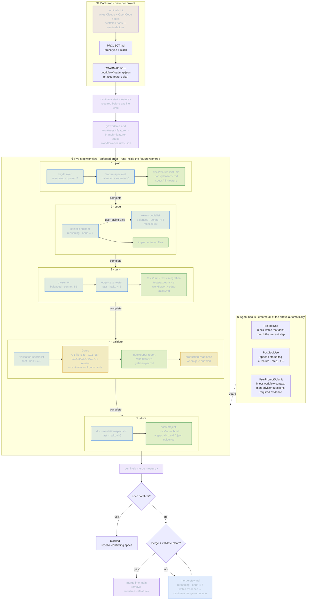

<p align="center">
  
</p>

# Centinela

> **Plan → code → tests → validate → docs — enforced.**

<p align="left">
  <a href="https://github.com/samuelnp/centinela/actions/workflows/validate.yml"></a>
  <a href="https://github.com/samuelnp/centinela/releases/latest"></a>
  <a href="https://github.com/samuelnp/centinela/blob/main/go.mod"></a>
  <a href="https://github.com/samuelnp/centinela/blob/main/LICENSE"></a>
  <a href="https://goreportcard.com/report/github.com/samuelnp/centinela"></a>
  <a href="https://github.com/samuelnp/centinela/stargazers"></a>
</p>

**A harness-governance layer for AI coding agents.** Centinela sits on top of Claude Code and OpenCode and makes your team's engineering discipline — `plan → code → tests → validate → docs` — *enforced* rather than *requested*. Every feature passes through guardrails, mechanical verification, and injected context automatically, so an agent's output looks like it came from a disciplined human team.

### 30-second tour

```bash
go install github.com/samuelnp/centinela@latest

centinela init                    # wire Claude/OpenCode hooks + scaffold docs/
centinela start my-feature        # required before any file write — opens "plan" step
# write docs/plans/my-feature.md + specs/my-feature.feature, then:
centinela complete my-feature     # advances plan → code (blocked if artifacts missing)
# … implement … advance through tests → validate → docs
centinela validate                # runs G1 file-size, i18n, your test/lint commands
```

If an agent tries to write source code while the workflow is in the `plan` step, the prewrite hook blocks the write and tells the agent what's missing.

### Contents

- [Demo](#demo)
- [Why Centinela](#why-centinela)
- [Centinela & Harness Engineering](#centinela--harness-engineering)
- [When *not* to use Centinela](#when-not-to-use-centinela)
- [How Centinela Works](#how-centinela-works)
- [Latest Features](#latest-features)
- [Install](#install)
- [Getting Started](#getting-started)
- [The Standard Five-Step Workflow](#the-standard-five-step-workflow)
- [How the Hooks Work](#how-the-hooks-work)
- [Consuming Governance via MCP](#consuming-governance-via-mcp)
- [Gate Checks](#gate-checks)
- [Architecture Archetypes](#architecture-archetypes)
- [`centinela.toml` Reference](#centinelatoml-reference)
- [Contributing](#contributing)
- [License](#license)

---

## Demo

<p align="center">
  
</p>

> A simulated Claude Code session: the PreToolUse hook blocks the ungoverned write,
> the agent starts the workflow, every file write is tagged with the active step,
> and the gates verify before anything ships — enforced, not requested.
>
> Recorded with [`vhs`](https://github.com/charmbracelet/vhs). To regenerate: `vhs assets/demo.tape` (the session script lives in `assets/demo.sh`).

---

## Why Centinela

AI coding agents are fast but undisciplined. Left to their own devices they skip planning, write tests as an afterthought, and ship without validation. Centinela fixes this by:

- **Blocking file writes** in the wrong workflow step via agent integrations
- **Requiring artifacts** before a step can advance — no plan file means no code, no tests means no validate
- **Running gate checks** automatically at the validate step (file size limits, i18n completeness, your test suite)
- **Injecting context** into every agent session so the model always knows which feature is active and which step it is on

The result: every feature ships with a written plan, a Gherkin spec, three test layers, and a passing gate suite — regardless of whether a human or an AI agent wrote it.

---

## Centinela & Harness Engineering

"Harness engineering" is the discipline of building the infrastructure around an
LLM that turns it into a reliable agent — the verification loops, guardrails,
context management, and environment control. Its guiding principle:

> Treat every agent failure as an engineering problem to fix permanently, not a
> prompt to retry. Make correctness **enforced**, not **requested**.

Centinela is **not an agent harness** — Claude Code and OpenCode are. Centinela
is the *governance layer* that sits on top of them and enforces how the harness
is used across a team. It owns the parts of harness engineering that decide
whether shipped code is trustworthy, and stays out of the parts the host agent
already does well:

| Harness subsystem            | Owned by Centinela | How                                                                 |
|------------------------------|:------------------:|---------------------------------------------------------------------|
| Verification & guardrails    |        ★★★         | PreToolUse blocks out-of-step writes; validate gates (file size, i18n, your test suite); gatekeeper + production-readiness subagents |
| Context engineering          |        ★★          | UserPromptSubmit injects the active feature, step, and required evidence; the plan advisor reads roadmap deps and prior edge-case lessons |
| Environment control          |        ★★          | `centinela init` wires hooks and scaffolds the rules; `migrate` updates them incrementally to prevent known failure modes |
| Tool integration layer       |         —          | delegated to Claude Code / OpenCode                                 |
| Memory & state management    |         ★          | `.workflow/*.json` tracks per-feature step state                    |
| The agent loop itself        |         —          | delegated to the host harness                                       |

The three principles of harness engineering map directly onto what Centinela
already does:

- **Environment control** → CLAUDE.md hard-rules, scaffolded docs, and `migrate`
  let you encode rules that prevent known failure modes — and keep them current.
- **Mechanical verification** → required artifacts and gates make correctness
  *checkable*: no plan file means no code, no tests means no validate.
- **Graceful recovery** → the merge-steward, missing-artifact recovery, and the
  plan advisor are designed for non-deterministic agent behavior.

In short: bring your own harness; Centinela makes sure it's used with discipline.

---

## When *not* to use Centinela

Centinela trades flexibility for discipline. Skip it if any of these apply:

- **Throwaway scripts / one-off experiments.** The 5-step ceremony is overhead you'll regret.
- **Solo prototyping in the first 48 hours of an idea.** Plans, specs, and gate suites are useful *after* you've validated the idea — not while you're still figuring out what to build.
- **You don't use an AI coding agent.** Centinela's strongest leverage is forcing structure on agent-generated code; humans typing every keystroke already have plenty of friction.
- **Your team has a different workflow you actually follow.** Centinela is opinionated. If your team already ships clean specs, tests, and docs without enforcement, the hooks will feel like a tax.

Centinela is for *production code* you intend to maintain, where an AI agent is doing meaningful work and you want the agent's output to look like it came from a disciplined human team.

---

## How Centinela Works

Bootstrap once, then every feature runs through five enforced steps **inside its own git worktree**, driven by specialist subagents and guarded by agent hooks, ending in a validated merge back to `main`.



**Legend** — 🟦 subagents (`tier · model`) · 🟩 required artifacts · 🟨 quality gates · 🟪 `centinela` commands. Model tiers shown are the built-in defaults; override any role via `[orchestration.models]` in `centinela.toml`. Each step only advances when `centinela complete` finds its required artifacts, and the hooks block any file write that doesn't belong to the current step.

---

## Latest Features

- **Claude + OpenCode parity** with shared setup prompts, workflow context, prewrite enforcement, postwrite status updates, setup-priority handling, and migration guidance.
- **Roadmap-first bootstrap** with automatic `PROJECT.md` setup, `ROADMAP.md` creation, `.workflow/roadmap.json`, roadmap analysis, roadmap quality artifacts, clear missing-artifact recovery, and `centinela roadmap validate`.
- **Strict five-step delivery** with enforced `plan -> code -> tests -> validate -> docs` order, required step artifacts, explicit step confirmation modes, and no workflow bypass for normal features.
- **Plan advisor mode** that reads current feature artifacts plus roadmap dependencies, same-phase siblings, quality notes, and prior edge-case lessons before asking a small set of high-value planning questions.
- **Actionable specialist orchestration** where `big-thinker`, `feature-specialist`, `senior-engineer`, `qa-senior`, `documentation-specialist`, and user-facing `ux-ui-specialist` evidence must point to real project outputs.
- **Stronger quality gates** including executable acceptance-test enforcement, validation-command coverage for acceptance tests, default 100-line source files, and audited G1 exceptions for rare 130-line cases.
- **Managed migrations and generated docs** through `centinela migrate`, `centinela migrate docs`, `centinela migrate setup --agent claude|opencode|both`, `centinela docs validate`, and `centinela docs generate`.
- **Cleaner workflow feedback** with compact `🛡️👁️` CLI output, status tags, and prompt-driven command mapping for roadmap, start, continue, validate, and docs flows.
- **Claim verification** with `centinela verify <feature>` that independently re-derives ground truth for every evidence claim (tests pass, coverage, non-stub outputs, edge-case mapping) and hard-blocks `centinela complete` at the validate step when any hard claim fails.
- **Cross-platform build gate** (`G-Build: Cross-Compile`) that cross-compiles every configured release target during `centinela validate` and fails naming the broken `GOOS/GOARCH` pair, so platform build errors are caught locally before the release pipeline. Configured via `[gates.build]` with `enabled`, `command`, and a `targets` list of `{goos, goarch}` pairs; default disabled. A parity test keeps the target list in sync with the release matrix in `.github/workflows/release.yml`.
- **MCP governance server** (`centinela.mcp/v1`) so any MCP-speaking harness consumes governance with zero Centinela-specific code. `centinela mcp serve` exposes `read_rules`, `run_gates`, `verify_claims`, and `workflow_state` over stdio (reusing the verdict packet); it is advisory (`allow`/`warn`/`block`). `centinela mcp shim` maps a `block` verdict onto the harness pre-write deny (`exit 2`), and a parity test keeps the MCP verdict identical to the native-hook verdict. See [Consuming Governance via MCP](#consuming-governance-via-mcp).

---

## Install

**Prerequisites:** Go 1.21+

```bash
go install github.com/samuelnp/centinela@latest
```

Or download a pre-built binary from [Releases](https://github.com/samuelnp/centinela/releases).

For macOS/Linux, you can install the latest release binary directly:

```bash
curl -fsSL https://raw.githubusercontent.com/samuelnp/centinela/main/scripts/install.sh | sh
```

Verify:

```bash
centinela --help
```

> **macOS/Linux:** `go install` places the binary in `~/go/bin`. Ensure that directory is on your PATH:
> ```bash
> export PATH="$HOME/go/bin:$PATH"  # add to ~/.zshrc or ~/.bashrc
> ```

---

## Getting Started

### 1. Initialize a project

Run once in your project root:

```bash
centinela init
```

This creates:

| File / Directory | Purpose |
|-----------------|---------|
| `CLAUDE.md` | Framework rules — used by Claude, and by OpenCode via compatibility mode |
| `PROJECT.md.template` | Fill in and rename to `PROJECT.md` |
| `centinela.toml` | Configure validate commands and gate checks |
| `docs/architecture/` | architecture reference documents + edge-case tester prompt |
| `docs/plans/` `specs/` `tests/` | Required empty directories |
| `.claude/settings.json` | Claude hooks wired automatically |
| `opencode.json` + `.opencode/plugins/centinela.js` | OpenCode integration wiring |

Safe to re-run — existing files are never overwritten.

`init` is the bootstrap command. For ongoing upgrades to managed docs and setup
artifacts, use `migrate` (preview by default, apply only with `--apply`).

Use `--local` to write Claude hooks to `.claude/settings.local.json` (useful for personal overrides without committing to the repo):

```bash
centinela init --local
```

Choose integration target explicitly when needed:

```bash
centinela init --agent claude
centinela init --agent opencode
centinela init --agent both   # default
```

### 2. Fill in PROJECT.md

Open your coding agent in the project — if `PROJECT.md` is missing, Centinela will prompt Claude or OpenCode to interview you and write it. Alternatively, rename `PROJECT.md.template` to `PROJECT.md` and complete every section manually. This file tells both you and the agent what the project is, which architecture pattern it follows, and where everything lives.

### 3. Configure centinela.toml

Add your stack's lint and test commands:

```toml
[validate]
commands = [
  "./scripts/check-coverage.sh",
]
```

Default coverage threshold is `95.0%`. Override temporarily with:

```bash
MIN_COVERAGE=96.5 ./scripts/check-coverage.sh
```

Commands run natively via the OS. No shell scripts, no bash dependency — works on Windows, macOS, and Linux.

#### Point Centinela at a local model

Declare a local backend with an `[orchestration.local]` block and `centinela init` / `centinela migrate` will wire the OpenCode provider for you — no hand-editing `opencode.json`. The block has four fields:

| Field | Required | Meaning |
|-------|----------|---------|
| `provider` | yes | `ollama` or `openai-compatible` |
| `endpoint` | yes | Base URL of the local server (OpenAI-compatible `/v1` path) |
| `model` | yes | Opaque model id passed through to the runner |
| `api_key_env` | no | Env var name whose value the runner reads as the API key (`openai-compatible` only) |

Both kinds drive an OpenAI-compatible endpoint through the npm `@ai-sdk/openai-compatible` provider; they differ only in whether an API-key reference is written.

```toml
# Ollama running locally — no API key needed.
[orchestration.local]
provider = "ollama"
endpoint = "http://localhost:11434/v1"
model    = "qwen2.5-coder"

# Any other OpenAI-compatible server (llama.cpp, vLLM, LM Studio, ...).
# Use api_key_env when the server expects an Authorization header.
[orchestration.local]
provider    = "openai-compatible"
endpoint    = "http://localhost:8080/v1"
model       = "my-local-model"
api_key_env = "LOCAL_API_KEY"   # runner reads the value of this env var
```

When a local block is present, `centinela init`/`migrate` add a **managed** provider block to `opencode.json` (`options.baseURL` from `endpoint`; `options.apiKey = "{env:NAME}"` for `openai-compatible` with `api_key_env`; the model under `models`). Centinela owns only its own provider key, never clobbering a user-written or foreign provider, and the wiring is idempotent — re-running rewrites it only on a real change. A config with no `[orchestration.local]` block produces byte-for-byte the same managed output as before.

A declared local `model` with no explicit capability class defaults to the `limited` capability → `strict` profile, as the strictly-lowest precedence tier — so you get maximum scaffolding just by declaring an endpoint. An explicit `--profile` or a global `[workflow] enforcement_profile` still wins. `centinela status` shows the provenance:

```
Profile  strict  (local default: qwen2.5-coder → limited → strict)
```

Centinela validates only the *shape* of the block (known `provider`, all-or-nothing, non-empty `endpoint` + `model`). The `endpoint`, `model`, and `api_key_env` strings are opaque — Centinela never connects to the server, verifies the model exists, or resolves the env var. Availability is the runner's job.

### Example: Bootstrap a new project

Use this flow when starting from scratch.

```bash
centinela init
```

Then open your coding agent in the repo and follow setup prompts.

Expected sequence:

1. If `PROJECT.md` is missing, centinela asks the agent to interview you and write it.
2. Once `PROJECT.md` exists, centinela asks the agent to define your roadmap.
3. The agent produces:
   `ROADMAP.md` (human-readable phased plan), `.workflow/roadmap.json` (machine-readable roadmap), `.workflow/roadmap-analysis.md`, `.workflow/roadmap-analysis.json`, `.workflow/roadmap-quality.md`, `.workflow/roadmap-quality.json`, and `docs/features/<feature-slug>.md` for the initial feature set.

If the agent misses one of those files, use `docs/architecture/artifact-templates.md` for the exact setup and per-feature workflow artifact shapes.

Verify roadmap status:

```bash
centinela roadmap
centinela roadmap validate
```

Start implementation from the first roadmap feature:

```bash
centinela start <first-feature-slug>
```

You can also use natural language instead of typing commands directly. The agent
maps your intent to centinela commands under the hood.

Roadmap and status intent examples:

- `Check roadmap`
- `Show roadmap progress`
- `What feature should we build next?`
- `What step are we currently in?`

Start feature intent examples:

- `Implement first feature`
- `Start the next roadmap feature`
- `Begin feature: user-auth`
- `Kick off checkout-flow`

Continue feature intent examples:

- `Continue current feature`
- `Resume work on billing-retries`
- `Complete this step`
- `Move to the next step for onboarding-wizard`

### 4. Start building

```bash
centinela start my-feature
```

For standard product features, follow the same path every time:

1. Write the plan artifacts in `docs/plans/` and `specs/`.
2. Run `centinela complete <feature>` to advance to `code`.
3. Implement the change, then advance to `tests`.
4. Add unit, integration, acceptance, and edge-case coverage, then advance to `validate`.
5. Run `centinela validate`, resolve any gate failures, then advance to `docs`.
6. Run `centinela docs validate` and `centinela docs generate` to publish the project-facing HTML output.

For a complete agent-collaboration example, see [`HOWTO.md`](HOWTO.md). It walks through using Centinela to generate a small landing page MVP without skipping the required workflow steps.

Proper use checklist:

- Start or resume a named feature before editing files: `centinela start <feature>` or `centinela status <feature>`.
- Keep all feature work inside the current step; if a write is blocked, create the missing artifact or advance the workflow instead of forcing the edit.
- Treat `complete` prompts as review gates. Approve advancement only after the current step artifacts exist and match the plan.
- Put acceptance tests in `tests/acceptance/` and ensure `[validate].commands` runs them.
- Finish with `centinela validate`, `centinela docs validate`, and `centinela docs generate --out docs/project-docs/index.html`.

### 5. Migrate managed assets

Preview all managed upgrades (docs + setup):

```bash
centinela migrate
```

Preview docs-only upgrades:

```bash
centinela migrate docs
```

Apply full sync:

```bash
centinela migrate --apply
```

Scope setup migration to one integration when needed:

```bash
centinela migrate setup --agent claude
centinela migrate setup --agent opencode
centinela migrate setup --agent both --apply
```

Regenerate the HTML presentation explicitly when needed:

```bash
centinela docs validate
centinela docs generate --out docs/project-docs/index.html --title "Centinela Project Documentation"
```

---

## The Standard Five-Step Workflow

Most delivery features follow the same five steps in order. Phase 0 bootstrap work can use a shorter roadmap-defined step order, but Centinela still enforces that order and its required artifacts.

```
plan → code → tests → validate → docs
```

| Step | What you produce | What centinela checks before advancing |
|------|-----------------|---------------------------------------|
| **plan** | Plan doc in `docs/plans/` + Gherkin spec in `specs/` | Both files exist on disk |
| **code** | Implementation | Nothing — architecture rules govern this step |
| **tests** | Unit, integration, acceptance + edge-case analysis | Test files exist + `.workflow/<feature>-edge-cases.md` exists |
| **validate** | Gatekeeper conflict report | All gate checks pass + all `centinela.toml` commands exit 0 |
| **docs** | Human-facing project documentation | `.workflow/<feature>-documentation-specialist.md` + `.workflow/<feature>-documentation-specialist.json` + `docs/project-docs/index.html` |

In strict orchestration mode, specialist evidence must be actionable:

- `big-thinker` and `feature-specialist` outputs must point to real `docs/plans/...` or `specs/...` artifacts.
- `senior-engineer` outputs must include at least one real non-evidence implementation file.
- `ux-ui-specialist` is required during `code` only for features whose brief declares `surface: user-facing`; its outputs must include at least one real UI file, `mobileFirst: true`, and the required UX review tags.
- `qa-senior` outputs must include at least one real test file and `.workflow/<feature>-edge-cases.md`.

UI path enforcement is configurable:

```toml
[orchestration]
ui_paths = ["src/ui", "src/components", "app/views", "web", "styles"]
```

Step confirmation prompts are configurable in `centinela.toml`:

```toml
[workflow]
step_confirmation_mode = "every_step" # every_step | after_plan | auto
plan_advisor_mode = "missing_info"   # missing_info | always | off
plan_question_limit = 4               # capped at 4 questions per round
```

### Workflow commands

```bash
centinela start <feature>       # Start a feature (required before any file writes)
centinela status <feature>      # Show current step and artifact status
centinela status-all            # Show all active features
centinela complete <feature>    # Mark step done and advance
centinela verify <feature>      # Independently re-derive ground truth for evidence claims
centinela roadmap               # Show roadmap phase and feature progress
centinela roadmap validate      # Validate roadmap analysis and quality artifacts
centinela validate              # Run gate checks manually
centinela migrate               # Preview full managed docs + setup migration
centinela migrate docs          # Preview managed docs migration only
centinela migrate setup         # Preview setup migration only
centinela docs validate         # Validate inputs for project documentation report
centinela docs generate         # Generate HTML docs with Mermaid diagrams
```

---

## How the Hooks Work

`centinela init` wires Claude and OpenCode integrations. Under the hood those integrations call `centinela hook ...` commands to keep workflow enforcement, setup guidance, and session context in sync.

### PreToolUse — Write / Edit

Before Claude writes or edits any file, centinela checks whether that file belongs to the current workflow step. If you are in the `plan` step and Claude tries to write a source file, the hook blocks it and explains why.

### PostToolUse — Write / Edit

After every file write, centinela appends a compact status tag to the session:

### Prompt Advisor — Plan Step

During the `plan` step, Centinela also injects a plan-advisor directive. By default it runs in
`missing_info` mode, inspects `docs/features/<feature>.md`, `docs/plans/<feature>.md`, and
`specs/<feature>.feature`, then enriches that with roadmap dependencies, same-phase sibling
features, roadmap quality notes, and related edge-case lessons. It asks up to 4 missing
high-value questions through `big-thinker` and `feature-specialist` lenses. Dependency context is
preferred before sibling context, and user-facing features receive UX/mobile-first questions only
when those topics are still missing.

```
↳ my-feature · code · 2/5
```

For Claude, Centinela can also render a compact status line so the current feature, step, and risk state stay visible outside the main response flow.

### UserPromptSubmit

Multiple hooks run at the start of every message:

**Project setup** — if `PROJECT.md` is missing but `PROJECT.md.template` exists, centinela injects a prompt instructing the agent to interview the user and write `PROJECT.md`. Once `PROJECT.md` exists, Centinela can also require `ROADMAP.md`, roadmap analysis artifacts, roadmap quality artifacts, and production-readiness setup before feature work continues.

**Managed migration** — if managed docs or setup assets are outdated, centinela
injects migration guidance and instructs the assistant to ask for approval before
running apply commands.

**Workflow context** — injects a context block showing all active workflows and their current step, so Claude always has accurate state without reading any files.

**Autostart + orchestration** — when no workflow is active, Centinela can auto-start a feature from prompt intent. In strict orchestration mode it also tells the agent which specialist evidence files are required before `centinela complete` can advance the step.

---

## Consuming Governance via MCP

The hooks above are harness-specific (Claude, OpenCode). For **any** other MCP-speaking harness, Centinela exposes the same governance as a versioned **Model Context Protocol** server — so a host with *zero* Centinela-specific code can obtain a verdict purely through tool calls.

```bash
centinela mcp serve   # runs the MCP server on stdio (schema: centinela.mcp/v1)
```

Register it with any MCP client. For a project-scoped `.mcp.json` (Claude Code, and most MCP hosts):

```json
{
  "mcpServers": {
    "centinela": { "command": "centinela", "args": ["mcp", "serve"] }
  }
}
```

### Tools (`centinela.mcp/v1`)

| Tool | Arguments | Returns |
|------|-----------|---------|
| `read_rules` | _(none)_ | profile, archetype, file-size limit, enabled gates, locales |
| `run_gates` | `feature?` | gate results + a `decision` (`allow`/`warn`/`block`) |
| `verify_claims` | `feature?` | claim-verification checks + a `decision` |
| `workflow_state` | `feature?` | active feature run provenance + on-disk evidence index |

`feature` is optional — omit it to use the active feature. Every result carries `"schema": "centinela.mcp/v1"` so harnesses can pin a compatibility level. A `run_gates` result looks like:

```json
{ "schema": "centinela.mcp/v1", "decision": "block",
  "gates": [ { "name": "G1: File Size", "status": "fail", "message": "internal/big/big.go: 134 lines (>100)" } ] }
```

### Advisory by protocol + the enforcement shim

The server is **advisory**: it returns `allow | warn | block` and *cannot itself stop a write*. Enforcement stays harness-side via a thin shim that maps a `block` verdict onto the harness's existing pre-write deny — the same `exit 2` contract the native hook uses:

```bash
centinela mcp shim            # active feature; exit 2 on block, 0 on allow/warn
centinela mcp shim my-feature # explicit feature
```

Wire it as a deny hook in the harness. The shim runs the full gate + claim suite, so prefer a once-per-turn `Stop` hook over a per-write `PreToolUse` matcher unless your gates are fast:

```json
{ "hooks": { "Stop": [
  { "hooks": [ { "type": "command", "command": "centinela mcp shim" } ] } ] } }
```

A `block` exits non-zero and the harness acts on the deny; `allow`/`warn` exit 0 and it proceeds. The MCP verdict is identical to the native-hook verdict for the same diff and workflow state (a parity test enforces this), so you can adopt MCP without changing how governance decides.

---

## Gate Checks

Gates are quality checks that must pass before a feature can ship. They run during `centinela validate` and automatically when completing the `validate` step.

### Claim verification at the validate step

When `centinela complete <feature>` advances through the `validate` step it runs claim verification as a HARD block. Any failing claim — tests that do not actually pass, a coverage figure that exceeds the measured result beyond tolerance, or an output file that contains only an empty stub — stops completion and names the failing claim. Edge-case mapping failures emit a warning and surface in the output but do not hard-block on their own.

Run verification at any time with:

```bash
centinela verify <feature>
```

See the [`[verify]` configuration block](#centinelatoml-reference) to adjust the timeout and coverage tolerance.

### Built-in gates

| Gate | Rule | Config |
|------|------|--------|
| **G1: File Size** | Default max 100 lines, with optional justified exceptions up to 130 lines | `[gates] file_size = true` |
| **G2: Layer Boundaries** | Parses the Go import graph and fails on any import that violates your declared per-layer allow-matrix | `[gates.import_graph]` |
| **G11: i18n** | All locale files have identical keys (no missing translations) | `[gates] i18n = true` |
| **G-Build: Cross-Compile** | Cross-compiles every configured release target and fails naming the broken `GOOS/GOARCH` | `[gates] build = true` |

#### Cross-compile build gate

The `G-Build: Cross-Compile` gate runs each target in your `[gates.build] targets` list through the configured build command, sets `GOOS`, `GOARCH`, and `CGO_ENABLED=0` automatically, and collects any failures. If any target fails, the gate reports `Fail` with a detail line per broken platform. Default is **disabled**.

```toml
[gates]
build = true

[gates.build]
command = "go build ./cmd/myapp"   # executed once per target; no shell expansion
targets = [
  { goos = "linux",   goarch = "amd64" },
  { goos = "linux",   goarch = "arm64" },
  { goos = "darwin",  goarch = "amd64" },
  { goos = "darwin",  goarch = "arm64" },
  { goos = "windows", goarch = "amd64" },
  { goos = "windows", goarch = "arm64" },
]
```

The `command` is argv-parsed (`strings.Fields`) and executed directly — never via a shell — so spaces in paths are safe and shell injection is not possible.

#### Layer-boundary (import-graph) gate

The `G2: Layer Boundaries` gate turns your architecture's layer rules into a mechanical check. It parses the Go import graph with `go list -json` (no extra dependency) and fails `centinela validate` when a package imports another package its layer is not allowed to import — for example a leaf `config` package reaching up into `ui`. You declare the matrix in `centinela.toml`: each layer has a name, path globs, and the list of layers it may import. Standard-library and third-party imports are ignored; a package that matches no configured layer produces a non-failing **warning** (so the matrix can be adopted incrementally) rather than passing silently. Default is **disabled**.

```toml
[gates.import_graph]
enabled = true
# module = "github.com/you/yourapp"   # optional; defaults to `go list -m`

[[gates.import_graph.layers]]
name  = "leaf"
paths = ["internal/config/**"]
allow = []                            # a leaf layer imports no other layer

[[gates.import_graph.layers]]
name  = "domain"
paths = ["internal/service/**"]
allow = ["leaf"]

[[gates.import_graph.layers]]
name  = "cmd"
paths = ["cmd/**"]
allow = ["domain", "leaf"]
```

A forbidden edge is reported as `internal/config -> internal/ui (leaf may not import domain)`. Same-layer and self imports are always allowed.

A companion parity test (`TestBuildMatrixParity`) keeps `[gates.build] targets` in `centinela.toml` in sync with the release matrix in `.github/workflows/release.yml`. If either list drifts, `go test ./...` fails during `centinela validate` and names the missing targets.

G11 supports two formats natively:

```toml
# JSON locale files (next-intl, i18next, vue-i18n)
[i18n]
format  = "json"
dir     = "src/i18n/messages"
locales = ["en", "es", "fr"]

# GNU gettext .po files (Godot, Qt)
[i18n]
format  = "gettext"
dir     = "i18n"
locales = ["en", "es"]
```

For other formats (Unity CSV, Android XML, iOS `.lproj`), set `format = "none"` and add a custom command to `[validate] commands`.

### Diff-aware mode

`centinela validate` can scope the file-walking gates (G1, G11) to files changed on the current branch, so the report flags only violations introduced by your work — not pre-existing ones in untouched files.

Default behavior (`diff_mode = "auto"`):

- **Locally** (no `CI` env var): diff-aware. Header reads `Built-in Gates (diff-aware: N files changed since main)`.
- **In CI** (`CI=true` or `CI=1`): full scan. Header reads `Built-in Gates (full scan)`. The ship gate stays strict.

Configure via `centinela.toml`:

```toml
[validate]
diff_mode = "auto"   # "auto" | "always" | "off"
diff_base = "main"   # any git ref (e.g. "master", "develop")
```

Override per invocation:

```bash
centinela validate --changed   # force diff-aware
centinela validate --full      # force full scan
```

Flags beat config, config beats CI detection. `--changed` and `--full` are mutually exclusive.

How the change set is built:

- `git diff --name-only --diff-filter=ACMR $(git merge-base HEAD <diff_base>)` for tracked changes.
- `git ls-files --others --exclude-standard` for untracked files (new code is gated before `git add`).
- Renamed files appear via the new path. Deleted files are naturally skipped.

G1 walks only files in the change set. G11 runs the full key-completeness comparison when any locale file is in the change set, and short-circuits with a "no locale changes" Pass otherwise (partial-locale comparison is not meaningful).

User `[validate] commands` are **not** scoped by the diff — they always run in full.

Degrade paths: non-git directory, missing diff base, shallow clone, or any git failure prints a one-line `notice:` and falls back to full scan.

CI systems that don't set `CI=true` (uncommon — GitHub Actions, GitLab CI, CircleCI, Travis, Buildkite, and Drone all do) need either `diff_mode = "off"` or `--full` in the pipeline.

### Manual gates (code review)

| Gate | Rule |
|------|------|
| **G2: Layer Dependencies** | No imports cross forbidden layer boundaries (archetype-specific) |
| **G3: Type Safety** | Strictest static analysis — no `any`, no untyped variables |
| **G5: Spec First** | Every feature has a `.feature` file before implementation starts |
| **G6: Plan First** | Every feature has a plan document before implementation starts |
| **G7: No Business Logic in Outer Layer** | UI components and adapters contain no domain logic |
| **G8: Single Responsibility** | Each file exports one thing and does one thing |

Full gate documentation: [`docs/architecture/gatekeepers.md`](internal/scaffold/assets/docs/architecture/gatekeepers.md)

---

## Architecture Archetypes

Centinela supports five architecture patterns. You choose one when filling in `PROJECT.md`. The choice determines which layer rules, forbidden imports, and test expectations apply.

| Archetype | Best for |
|-----------|---------|
| **Hexagonal** | Multiple external integrations (APIs, databases), domain logic that must be testable without infrastructure |
| **Rails-native** | Framework-opinionated stacks (Rails, Django, Laravel) — follow the framework conventions |
| **N-Tier** | Classic layered apps: HTTP handlers → services → repositories |
| **ECS** | Games — entities, components, and systems |
| **Modular** | Monorepo-style projects with clear public API contracts between modules |

Each archetype has its own layer dependency rules (G2), outer-layer definition (G7), and test coverage expectations (G4).

See [`docs/architecture/architecture-overview.md`](internal/scaffold/assets/docs/architecture/architecture-overview.md) for the full comparison.

---

## centinela.toml Reference

```toml
# Commands centinela runs during the validate step.
# Executed natively — no shell scripts required.
[validate]
commands = [
  # TypeScript:  "npx tsc --noEmit", "npx vitest run", "npx cucumber-js"
  # Python:      "mypy --strict src", "pytest", "behave"
  # Go:          "go vet ./...", "go test ./..."      # includes tests/acceptance
  # Ruby:        "bundle exec rubocop", "bundle exec rspec", "bundle exec cucumber"
  # Rust:        "cargo check", "cargo test"          # add acceptance runner if separate
]
diff_mode = "auto"   # "auto" (default) | "always" | "off" — see Diff-aware mode above
diff_base = "main"   # any git ref; merge-base with this branch defines the change set

# Built-in gate toggles
[gates]
file_size = true   # G1: fail if any source file exceeds 100 lines by default
i18n      = false  # G11: check translation key completeness
build     = false  # G-Build: cross-compile every release target (default off)

# Cross-compile build gate (required when gates.build = true)
[gates.build]
command = "go build ./cmd/myapp"   # build command; run once per target with GOOS/GOARCH/CGO_ENABLED=0 set
targets = [
  { goos = "linux",   goarch = "amd64" },
  { goos = "linux",   goarch = "arm64" },
  { goos = "darwin",  goarch = "amd64" },
  { goos = "darwin",  goarch = "arm64" },
  { goos = "windows", goarch = "amd64" },
  { goos = "windows", goarch = "arm64" },
]

# Optional: explicit justified G1 exceptions for rare cases
[[gates.file_size_exceptions]]
path = "internal/config/generated_map.go"
kind = "configuration"  # "configuration" or "domain_atomic"
reason = "Large static map is clearer as one unit"
max_lines = 130

# i18n config (required when gates.i18n = true)
[i18n]
format  = "json"              # "json" | "gettext" | "none"
dir     = "src/i18n/messages"
locales = ["en"]

# Claim verification — controls centinela verify and the complete-gate check
[verify]
verify_timeout     = 60    # seconds before a test command is killed during verification (default: 60)
coverage_tolerance = 0.001 # maximum allowed gap between a claimed and measured coverage figure (default: 0.001 = 0.1%)
```

---

## Generated Project Structure

After `centinela init` and filling in `PROJECT.md`:

```
your-project/
  CLAUDE.md                      ← framework rules (auto-loaded by Claude)
  PROJECT.md                     ← project definition
  centinela.toml                 ← validate commands + gate config
  .claude/
    settings.json                ← centinela hooks
  .workflow/
    <feature>.json               ← workflow state per feature
    <feature>-gatekeeper.md      ← gatekeeper conflict report
  docs/
    architecture/                ← 16 reference documents
    plans/                       ← one plan doc per feature
  specs/
    <feature>.feature            ← Gherkin acceptance criteria
  tests/
    unit/
    integration/
    acceptance/
      <feature>.steps.*          ← executable Gherkin step definitions
```

---

## Included Architecture Documentation

`centinela init` copies 16 reference documents into `docs/architecture/`:

| Document | Contents |
|----------|---------|
| `architecture-overview.md` | All five archetypes compared — when to use each |
| `artifact-templates.md` | Exact setup and per-feature workflow artifact templates |
| `hexagonal.md` | Ports-and-adapters layers, dependency rules, forbidden imports |
| `rails-native.md` | MVC conventions, what belongs in models vs services vs views |
| `n-tier.md` | Controller → Service → Repository layer rules |
| `ecs.md` | Entity-Component-System patterns for games |
| `modular.md` | Module boundaries and public API contracts |
| `dependency-injection.md` | DI container patterns across archetypes |
| `testing-strategy.md` | Unit, integration, and acceptance test structure for all archetypes |
| `gatekeepers.md` | Full gate reference (G1–G11) with per-archetype rules |
| `gatekeeper-prompt.md` | Prompt for the Gatekeeper AI subagent conflict review |
| `documentation-generator-prompt.md` | LLM-first prompt template for polished docs generation with CLI fallback |
| `workflow-enforcement.md` | How the three enforcement layers work |
| `i18n-strategy.md` | Translation key conventions by format |
| `example-feature-walkthrough.md` | End-to-end example of the five-step workflow |
| `new-project-guide.md` | Step-by-step setup for new projects |

---

## Build from Source

```bash
git clone https://github.com/samuelnp/centinela
cd centinela
go build -o centinela ./cmd/centinela/
```

Cross-compile for other platforms:

```bash
GOOS=linux   GOARCH=amd64 go build -o centinela-linux-amd64  ./cmd/centinela/
GOOS=darwin  GOARCH=arm64 go build -o centinela-darwin-arm64 ./cmd/centinela/
GOOS=windows GOARCH=amd64 go build -o centinela-windows.exe  ./cmd/centinela/
```

---

## Contributing

Centinela uses its own workflow to develop itself.

```bash
centinela start <feature-name>
# plan → code → tests → validate → docs
centinela complete <feature-name>
```

Conventional commits: `feat:`, `fix:`, `refactor:`, `test:`, `docs:`, `chore:`.
One feature per branch. Never push failing tests.

---

## License

MIT
